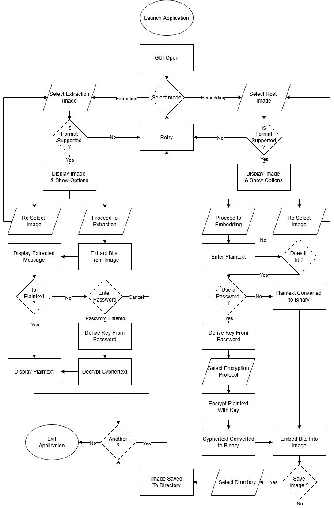

# Steganography Bachelor Semester Project

This project is developed as part of my first-semester Bachelor of Computer Science studies at the University of Luxembourg.

## Abstract

The goal of this Bachelor Semester Project is to develop a Python-based tool that embeds
messages into images, concealing the existence of the hidden content within the host
media. The system will ask the user to provide an image, a plaintext message, and a password,
and will generate a modified image containing the hidden content.

The project will combine a steganographic embedding process (such as Least Significant
Bit or alternative approaches) with an additional encryption (e.g AES) layer applied to the
message before embedding. This encryption layer will ensure that, even if hidden data is
detected and extracted, the hidden message remains protected.

We will also evaluate how much the embedding and encryption processes alter the image,
how detectable and secure the hidden message may be, and what trade-offs exist
between security, payload size, and image quality.

In addition to the embedding software, a secondary rudimentary steganalysis tool may
be developed to simulate attack scenarios. This tool will attempt to detect the presence
of hidden messages and perform brute-force attempts against the encryption layer. This
component will serve to test the robustness of the system under malicious attacks.

### System workflow
- The sender provides an image, a plaintext message, and a password.
- The message is compressed then encrypted using Fernet.
- The encrypted message is embedded into the image using LSB embedding.
- The receiver provides the modified image and the correct password to extract, 
  decrypt and decompress the hidden message.

### Investigation points
- Security properties of the chosen encryption scheme.
- Resistance of the steganographic method against basic steganalysis.
- Trade-offs between payload size, security, and image distortion.
- Implementation challenges and performance considerations.

## Flowchart

## How to Run the Program

...
